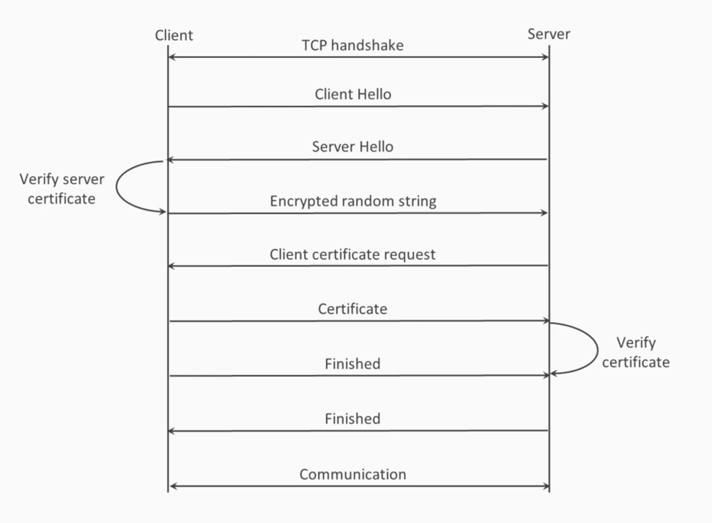

 # OpenSSL example
 
 Http is insecure
 - vulnerable to a range of attacks
 - this necessary to add security
 - RFC 2818 proposed HTTPS
 - initially this was secure socket layer
 - evolved into transport layer security

 

 openssl can help this is:
 - a complete set of tools to work with SSL
 - an open source project
 - rust has bindings for using openssl as a library

 ## Compiling

 Make sure the openssl development files are present

 ```bash
sudo apt update
sudo apt install -y pkg-config libssl-dev
```

## Running

```bash
$ RUST_LOG=debug cargo run
   Compiling openssl_example v0.1.0 (/home/bvpelt/Develop/rwebserver/openssl_example)
    Finished `dev` profile [unoptimized + debuginfo] target(s) in 0.21s
     Running `/home/bvpelt/Develop/rwebserver/target/debug/openssl_example`
 2026-07-30T13:46:28.654Z INFO  openssl_example > Launching openssl_example version: 0.1
 2026-07-30T13:46:28.656Z DEBUG openssl_example > serial_number (hex): 0199F2EA205BBCD649F0FEFC9BC423A235E3468E
 2026-07-30T13:46:28.656Z DEBUG openssl_example > serial_number (dec): 9142165628479995294137036055132971824960456334
 2026-07-30T13:46:28.656Z DEBUG openssl_example > cert name issuer and subject: /C=UK/CN=Our common name
 2026-07-30T13:46:28.656Z DEBUG openssl_example > not_before: 2026-07-30T13:46:28+00:00
 2026-07-30T13:46:28.656Z DEBUG openssl_example > not_after:  2027-07-30T13:46:28+00:00
 2026-07-30T13:46:29.109Z DEBUG openssl_example > Private Key Details (RSA 3072):
 2026-07-30T13:46:29.109Z DEBUG openssl_example >   Public Exponent (e): 65537
 2026-07-30T13:46:29.109Z DEBUG openssl_example >   Modulus bit length:  3072
 2026-07-30T13:46:29.109Z DEBUG openssl_example >   Modulus (n, hex):    B9156B9A4416167E96DF7AB3447094DB00EBA2C10B3F8676A4CE0F87A5993831DED652B21C1E7EA4CA0CFC1D187637D8025F755A9698E30C654FD80E68100C42D2A96625BCCA1467D38CFC09028F5B1539BDB346CE7104C6C84A11F43274D18CFBB6698D20D736BDB551EFDAEF5F852C0E87BFB0887631468BC10227E1B193C3ABED9B5112F562D06C729034AE2054D4C1DBC1DFC023EBF39D09F7DCEC6103E85C51E8677601641A76E979345176636F25EC78FA32A27D7CF1054DAC9B011FB498CB51A37D20C97BD1A046F971459BFBDE70AF1D519FE9138A85F463FC4CA6CD8D895D3443443EF3D7B030AA54CF9B282A3C86D2C6054974FA0FE0590F34D1C80A7045D16A5B80C33D2706ABF3AB19112342DA445DA9DB3BAC59B4C986BBA74FAAFD69FE879D5CF307B01BC14186FF7C48B49FDA4D267256E22417DD506F90E6929EB9D39C46DE41A4EE5D9D7DE56A7FA596CF42BEC3635F621F9FE63121525A88CA32DE67EA679DA04BC44321FB37608533E657EDE3E13A9613C7AC5CD69F47
 2026-07-30T13:46:29.111Z DEBUG openssl_example > Certificate Details:
Certificate:
    Data:
        Version: 3 (0x2)
        Serial Number:
            01:99:f2:ea:20:5b:bc:d6:49:f0:fe:fc:9b:c4:23:a2:35:e3:46:8e
        Signature Algorithm: sha512WithRSAEncryption
        Issuer: C=UK, CN=Our common name
        Validity
            Not Before: Jul 30 13:46:28 2026 GMT
            Not After : Jul 30 13:46:28 2027 GMT
        Subject: C=UK, CN=Our common name
        Subject Public Key Info:
            Public Key Algorithm: rsaEncryption
                RSA Public-Key: (3072 bit)
                Modulus:
                    00:b9:15:6b:9a:44:16:16:7e:96:df:7a:b3:44:70:
                    94:db:00:eb:a2:c1:0b:3f:86:76:a4:ce:0f:87:a5:
                    99:38:31:de:d6:52:b2:1c:1e:7e:a4:ca:0c:fc:1d:
                    18:76:37:d8:02:5f:75:5a:96:98:e3:0c:65:4f:d8:
                    0e:68:10:0c:42:d2:a9:66:25:bc:ca:14:67:d3:8c:
                    fc:09:02:8f:5b:15:39:bd:b3:46:ce:71:04:c6:c8:
                    4a:11:f4:32:74:d1:8c:fb:b6:69:8d:20:d7:36:bd:
                    b5:51:ef:da:ef:5f:85:2c:0e:87:bf:b0:88:76:31:
                    46:8b:c1:02:27:e1:b1:93:c3:ab:ed:9b:51:12:f5:
                    62:d0:6c:72:90:34:ae:20:54:d4:c1:db:c1:df:c0:
                    23:eb:f3:9d:09:f7:dc:ec:61:03:e8:5c:51:e8:67:
                    76:01:64:1a:76:e9:79:34:51:76:63:6f:25:ec:78:
                    fa:32:a2:7d:7c:f1:05:4d:ac:9b:01:1f:b4:98:cb:
                    51:a3:7d:20:c9:7b:d1:a0:46:f9:71:45:9b:fb:de:
                    70:af:1d:51:9f:e9:13:8a:85:f4:63:fc:4c:a6:cd:
                    8d:89:5d:34:43:44:3e:f3:d7:b0:30:aa:54:cf:9b:
                    28:2a:3c:86:d2:c6:05:49:74:fa:0f:e0:59:0f:34:
                    d1:c8:0a:70:45:d1:6a:5b:80:c3:3d:27:06:ab:f3:
                    ab:19:11:23:42:da:44:5d:a9:db:3b:ac:59:b4:c9:
                    86:bb:a7:4f:aa:fd:69:fe:87:9d:5c:f3:07:b0:1b:
                    c1:41:86:ff:7c:48:b4:9f:da:4d:26:72:56:e2:24:
                    17:dd:50:6f:90:e6:92:9e:b9:d3:9c:46:de:41:a4:
                    ee:5d:9d:7d:e5:6a:7f:a5:96:cf:42:be:c3:63:5f:
                    62:1f:9f:e6:31:21:52:5a:88:ca:32:de:67:ea:67:
                    9d:a0:4b:c4:43:21:fb:37:60:85:33:e6:57:ed:e3:
                    e1:3a:96:13:c7:ac:5c:d6:9f:47
                Exponent: 65537 (0x10001)
    Signature Algorithm: sha512WithRSAEncryption
    Signature Value:
        a1:10:d3:6a:bd:ad:e3:0e:3f:79:29:e3:e9:a6:2d:42:37:a0:
        c7:63:42:a1:a7:a1:17:56:e6:70:7c:7d:c9:63:07:35:cd:ed:
        b2:9c:39:66:b3:33:11:55:62:a6:34:ce:28:85:bc:eb:3b:27:
        03:e8:c3:52:c3:c2:fb:c9:0e:2c:55:6a:22:ea:64:a0:bf:04:
        77:81:b5:f4:1c:9f:86:5b:e7:ea:68:81:22:5f:ea:1e:3f:55:
        6f:b7:9b:98:a8:5b:f7:a7:64:80:39:ec:66:cb:b3:cc:6e:8e:
        5d:3a:ff:76:45:c4:55:8c:ae:aa:a0:03:f4:a3:cf:e1:d4:f5:
        9c:63:fb:53:2b:92:b5:37:f2:0b:d4:4f:3f:26:14:ea:26:1d:
        b4:61:b4:7f:70:6c:7d:c5:4e:f2:e9:02:48:3b:15:c3:df:8a:
        24:c8:df:f0:fe:59:c3:82:7a:5f:b8:4f:36:70:d1:a6:b2:6a:
        56:71:5d:36:a7:96:57:f4:be:c4:60:66:df:ad:04:c4:9f:1d:
        74:e6:89:d5:71:c2:61:ea:d4:ce:05:ab:82:d6:1f:f9:28:71:
        75:88:1a:37:49:56:e6:ea:48:d8:0e:2c:5c:d4:42:f1:99:aa:
        d2:33:03:16:3b:e8:1b:bd:df:e3:e7:b1:fc:40:21:15:9c:88:
        31:3e:6a:39:b9:00:6b:a6:36:08:af:08:16:d2:4c:8d:0a:77:
        da:5a:31:41:db:09:ce:0a:80:c8:1b:65:ef:4d:41:73:f8:8c:
        59:73:49:94:f1:cd:84:cc:84:77:af:b8:bb:10:c8:c4:db:f0:
        d7:ca:12:09:42:02:1d:26:35:4a:a6:c6:d2:67:1d:2a:ff:4c:
        06:79:10:95:fc:37:d9:1d:fa:00:3e:79:d8:dc:72:02:39:0b:
        68:0c:78:6e:ee:cc:7a:61:65:6d:30:8f:27:70:46:ae:45:7d:
        59:7f:96:d0:dd:02:2a:9a:0b:ed:2d:44:c9:4b:8a:d4:6c:14:
        f4:48:f3:e8:a4:8c

 2026-07-30T13:46:29.111Z INFO  openssl_example > Successfully generated self-signed certificate!
 2026-07-30T13:46:29.111Z INFO  openssl_example > Certificate Subject CN: UK
 2026-07-30T13:46:29.112Z INFO  openssl_example > Saved certificate to 'cert.pem'
 2026-07-30T13:46:29.112Z INFO  openssl_example > Saved private key to 'key.pem'
```

### Verification

Verification of the certificate

```bash
$ openssl x509 -in cert.pem -text -noout
Certificate:
    Data:
        Version: 3 (0x2)
        Serial Number:
            01:99:f2:ea:20:5b:bc:d6:49:f0:fe:fc:9b:c4:23:a2:35:e3:46:8e
        Signature Algorithm: sha512WithRSAEncryption
        Issuer: C = UK, CN = Our common name
        Validity
            Not Before: Jul 30 13:46:28 2026 GMT
            Not After : Jul 30 13:46:28 2027 GMT
        Subject: C = UK, CN = Our common name
        Subject Public Key Info:
            Public Key Algorithm: rsaEncryption
                Public-Key: (3072 bit)
                Modulus:
                    00:b9:15:6b:9a:44:16:16:7e:96:df:7a:b3:44:70:
                    94:db:00:eb:a2:c1:0b:3f:86:76:a4:ce:0f:87:a5:
                    99:38:31:de:d6:52:b2:1c:1e:7e:a4:ca:0c:fc:1d:
                    18:76:37:d8:02:5f:75:5a:96:98:e3:0c:65:4f:d8:
                    0e:68:10:0c:42:d2:a9:66:25:bc:ca:14:67:d3:8c:
                    fc:09:02:8f:5b:15:39:bd:b3:46:ce:71:04:c6:c8:
                    4a:11:f4:32:74:d1:8c:fb:b6:69:8d:20:d7:36:bd:
                    b5:51:ef:da:ef:5f:85:2c:0e:87:bf:b0:88:76:31:
                    46:8b:c1:02:27:e1:b1:93:c3:ab:ed:9b:51:12:f5:
                    62:d0:6c:72:90:34:ae:20:54:d4:c1:db:c1:df:c0:
                    23:eb:f3:9d:09:f7:dc:ec:61:03:e8:5c:51:e8:67:
                    76:01:64:1a:76:e9:79:34:51:76:63:6f:25:ec:78:
                    fa:32:a2:7d:7c:f1:05:4d:ac:9b:01:1f:b4:98:cb:
                    51:a3:7d:20:c9:7b:d1:a0:46:f9:71:45:9b:fb:de:
                    70:af:1d:51:9f:e9:13:8a:85:f4:63:fc:4c:a6:cd:
                    8d:89:5d:34:43:44:3e:f3:d7:b0:30:aa:54:cf:9b:
                    28:2a:3c:86:d2:c6:05:49:74:fa:0f:e0:59:0f:34:
                    d1:c8:0a:70:45:d1:6a:5b:80:c3:3d:27:06:ab:f3:
                    ab:19:11:23:42:da:44:5d:a9:db:3b:ac:59:b4:c9:
                    86:bb:a7:4f:aa:fd:69:fe:87:9d:5c:f3:07:b0:1b:
                    c1:41:86:ff:7c:48:b4:9f:da:4d:26:72:56:e2:24:
                    17:dd:50:6f:90:e6:92:9e:b9:d3:9c:46:de:41:a4:
                    ee:5d:9d:7d:e5:6a:7f:a5:96:cf:42:be:c3:63:5f:
                    62:1f:9f:e6:31:21:52:5a:88:ca:32:de:67:ea:67:
                    9d:a0:4b:c4:43:21:fb:37:60:85:33:e6:57:ed:e3:
                    e1:3a:96:13:c7:ac:5c:d6:9f:47
                Exponent: 65537 (0x10001)
    Signature Algorithm: sha512WithRSAEncryption
    Signature Value:
        a1:10:d3:6a:bd:ad:e3:0e:3f:79:29:e3:e9:a6:2d:42:37:a0:
        c7:63:42:a1:a7:a1:17:56:e6:70:7c:7d:c9:63:07:35:cd:ed:
        b2:9c:39:66:b3:33:11:55:62:a6:34:ce:28:85:bc:eb:3b:27:
        03:e8:c3:52:c3:c2:fb:c9:0e:2c:55:6a:22:ea:64:a0:bf:04:
        77:81:b5:f4:1c:9f:86:5b:e7:ea:68:81:22:5f:ea:1e:3f:55:
        6f:b7:9b:98:a8:5b:f7:a7:64:80:39:ec:66:cb:b3:cc:6e:8e:
        5d:3a:ff:76:45:c4:55:8c:ae:aa:a0:03:f4:a3:cf:e1:d4:f5:
        9c:63:fb:53:2b:92:b5:37:f2:0b:d4:4f:3f:26:14:ea:26:1d:
        b4:61:b4:7f:70:6c:7d:c5:4e:f2:e9:02:48:3b:15:c3:df:8a:
        24:c8:df:f0:fe:59:c3:82:7a:5f:b8:4f:36:70:d1:a6:b2:6a:
        56:71:5d:36:a7:96:57:f4:be:c4:60:66:df:ad:04:c4:9f:1d:
        74:e6:89:d5:71:c2:61:ea:d4:ce:05:ab:82:d6:1f:f9:28:71:
        75:88:1a:37:49:56:e6:ea:48:d8:0e:2c:5c:d4:42:f1:99:aa:
        d2:33:03:16:3b:e8:1b:bd:df:e3:e7:b1:fc:40:21:15:9c:88:
        31:3e:6a:39:b9:00:6b:a6:36:08:af:08:16:d2:4c:8d:0a:77:
        da:5a:31:41:db:09:ce:0a:80:c8:1b:65:ef:4d:41:73:f8:8c:
        59:73:49:94:f1:cd:84:cc:84:77:af:b8:bb:10:c8:c4:db:f0:
        d7:ca:12:09:42:02:1d:26:35:4a:a6:c6:d2:67:1d:2a:ff:4c:
        06:79:10:95:fc:37:d9:1d:fa:00:3e:79:d8:dc:72:02:39:0b:
        68:0c:78:6e:ee:cc:7a:61:65:6d:30:8f:27:70:46:ae:45:7d:
        59:7f:96:d0:dd:02:2a:9a:0b:ed:2d:44:c9:4b:8a:d4:6c:14:
        f4:48:f3:e8:a4:8c
```

Verification of the key

```bash
$ openssl pkey -in key.pem -check -noout
Key is valid

$ openssl pkey -in key.pem -text -noout
Private-Key: (3072 bit, 2 primes)
modulus:
    00:b9:15:6b:9a:44:16:16:7e:96:df:7a:b3:44:70:
    94:db:00:eb:a2:c1:0b:3f:86:76:a4:ce:0f:87:a5:
    99:38:31:de:d6:52:b2:1c:1e:7e:a4:ca:0c:fc:1d:
    18:76:37:d8:02:5f:75:5a:96:98:e3:0c:65:4f:d8:
    0e:68:10:0c:42:d2:a9:66:25:bc:ca:14:67:d3:8c:
    fc:09:02:8f:5b:15:39:bd:b3:46:ce:71:04:c6:c8:
    4a:11:f4:32:74:d1:8c:fb:b6:69:8d:20:d7:36:bd:
    b5:51:ef:da:ef:5f:85:2c:0e:87:bf:b0:88:76:31:
    46:8b:c1:02:27:e1:b1:93:c3:ab:ed:9b:51:12:f5:
    62:d0:6c:72:90:34:ae:20:54:d4:c1:db:c1:df:c0:
    23:eb:f3:9d:09:f7:dc:ec:61:03:e8:5c:51:e8:67:
    76:01:64:1a:76:e9:79:34:51:76:63:6f:25:ec:78:
    fa:32:a2:7d:7c:f1:05:4d:ac:9b:01:1f:b4:98:cb:
    51:a3:7d:20:c9:7b:d1:a0:46:f9:71:45:9b:fb:de:
    70:af:1d:51:9f:e9:13:8a:85:f4:63:fc:4c:a6:cd:
    8d:89:5d:34:43:44:3e:f3:d7:b0:30:aa:54:cf:9b:
    28:2a:3c:86:d2:c6:05:49:74:fa:0f:e0:59:0f:34:
    d1:c8:0a:70:45:d1:6a:5b:80:c3:3d:27:06:ab:f3:
    ab:19:11:23:42:da:44:5d:a9:db:3b:ac:59:b4:c9:
    86:bb:a7:4f:aa:fd:69:fe:87:9d:5c:f3:07:b0:1b:
    c1:41:86:ff:7c:48:b4:9f:da:4d:26:72:56:e2:24:
    17:dd:50:6f:90:e6:92:9e:b9:d3:9c:46:de:41:a4:
    ee:5d:9d:7d:e5:6a:7f:a5:96:cf:42:be:c3:63:5f:
    62:1f:9f:e6:31:21:52:5a:88:ca:32:de:67:ea:67:
    9d:a0:4b:c4:43:21:fb:37:60:85:33:e6:57:ed:e3:
    e1:3a:96:13:c7:ac:5c:d6:9f:47
publicExponent: 65537 (0x10001)
privateExponent:
    12:91:0f:31:f2:d7:3d:bb:1b:35:75:f5:ef:cd:54:
    bc:17:7e:8b:dd:79:07:0e:b2:6e:31:41:a6:3b:90:
    2a:ee:a3:1f:b5:91:ff:cc:cb:55:8a:9d:fc:d8:8a:
    5b:54:44:cb:65:7a:11:f3:fe:32:f5:f6:5f:d3:c3:
    b6:35:63:40:27:7e:83:81:bb:a0:e5:fa:78:62:b1:
    e7:26:d0:ec:b3:d7:64:01:4c:fe:be:a0:5a:5f:3d:
    ec:49:26:9a:9e:14:2f:82:b5:59:f3:f6:6d:9b:b5:
    9f:1a:44:48:89:0e:2f:44:e7:37:42:8f:f3:3e:04:
    34:01:7b:a4:36:8e:d2:cc:e9:3d:5f:bc:4f:fe:3a:
    6d:c0:18:9f:56:0e:e0:58:17:89:0e:f0:dc:44:f1:
    15:90:0d:ab:dc:a7:d6:8a:9b:92:be:ad:74:cb:e9:
    84:40:34:d6:18:46:66:b4:d9:54:7b:92:3e:ae:45:
    78:63:8b:da:71:c4:8a:18:8b:95:74:46:ef:90:09:
    ac:a0:27:3d:91:3f:e4:ba:38:d4:55:63:26:d2:06:
    32:a2:40:08:ab:a4:b1:00:22:c4:e3:d9:16:c5:b8:
    24:d7:42:35:9f:08:8c:cd:00:7a:d8:8d:5d:a6:91:
    34:39:b9:ac:1c:1a:79:b3:9d:50:b7:da:8d:cc:49:
    bc:0b:a2:46:25:ff:80:20:04:e9:82:f8:e6:cb:5b:
    65:3b:76:7f:0b:b9:71:7c:b4:30:4d:e9:59:ee:95:
    c2:4c:9e:61:fb:a5:8f:14:a3:f3:16:90:ff:a8:ca:
    39:89:34:52:1e:29:b0:73:6f:df:82:8f:82:68:c8:
    9c:89:ed:2e:04:c9:f3:12:a2:1c:98:d9:af:58:36:
    ff:15:65:4d:38:24:5d:4e:cb:4f:2b:d5:d2:be:b5:
    bd:17:85:9c:b1:0e:f1:66:8f:64:9a:d8:fb:31:9b:
    39:44:34:fb:be:b0:e8:d8:95:ab:37:eb:96:82:fd:
    a2:47:3e:ad:57:26:d5:c9:81
prime1:
    00:e5:70:7d:af:d7:0e:82:a9:93:71:e0:72:bb:8f:
    52:5a:86:36:a9:a6:5c:cb:79:ae:c5:90:cf:d4:16:
    ab:4b:ed:62:44:28:18:2c:d0:ca:f1:5f:c4:a0:b4:
    66:99:3f:15:2d:2d:1b:95:31:9c:94:97:41:ae:d8:
    b8:05:7b:5a:92:19:47:79:2d:98:2a:ce:45:1b:33:
    2a:fc:de:3a:7e:4c:06:8a:22:e5:65:f3:2a:33:5e:
    ab:db:2d:b1:20:af:ad:23:75:76:67:d2:80:4c:56:
    bf:3d:b3:03:2d:c9:81:31:43:4c:27:46:4e:5b:21:
    ad:96:0b:5d:08:14:64:de:90:1d:d3:ee:fd:10:db:
    7e:ab:03:fa:c0:40:72:f4:2d:3a:43:88:06:5e:46:
    87:ed:0c:0e:b6:68:66:32:26:34:a9:ac:9d:90:a8:
    1f:3c:9c:5f:f2:5b:12:46:27:39:db:66:43:c2:7a:
    1d:e9:7a:21:a0:d5:f7:bd:d1:4d:93:56:41
prime2:
    00:ce:82:6e:d6:e7:bd:c3:65:1d:f4:10:9e:0d:40:
    8e:21:1f:a5:a9:b4:ca:bd:51:58:27:67:23:df:87:
    a1:b1:bb:13:7b:89:bf:b3:ce:ea:39:0d:86:ec:52:
    ce:35:95:5f:5e:9b:1f:c8:57:9a:1a:24:cb:fa:7e:
    fa:fd:05:ff:e6:91:c2:33:e8:cb:d6:9c:41:c4:dd:
    bc:cd:18:8c:30:89:3b:ee:5a:64:0c:26:aa:eb:2c:
    45:04:be:34:31:84:98:36:89:41:1d:50:1a:92:02:
    fd:10:89:74:bd:e0:13:b7:72:c1:d6:ba:7b:0d:35:
    9f:aa:dd:0c:4b:5e:51:c0:01:b3:16:63:c8:d4:39:
    74:87:b8:07:83:98:a8:24:70:b3:39:ee:5c:fa:e1:
    4d:c1:0a:d0:a2:72:8b:23:27:c7:d6:78:04:7b:14:
    e7:2f:ac:2d:54:74:32:52:30:ff:8c:e7:af:ff:da:
    50:ca:fb:24:64:18:c6:ac:79:11:89:63:87
exponent1:
    00:de:67:0f:7e:6e:a1:63:28:cb:82:fc:45:5a:e8:
    0f:b5:2e:1a:38:92:c9:aa:77:36:61:ce:00:97:1e:
    ae:46:f8:41:63:bd:d5:c9:43:4f:25:70:66:a2:3c:
    9c:a3:79:d1:a6:2b:ee:6b:cd:5e:71:6e:b9:3d:aa:
    57:9f:00:b6:87:9e:37:79:10:28:4b:7e:0c:e0:d3:
    d5:9c:ae:31:d7:11:0c:d9:c3:ff:c7:b6:51:36:e0:
    53:08:2f:9f:5e:06:cc:76:ed:ba:ab:e3:11:78:6e:
    32:0c:b5:c4:a4:12:8a:c7:dc:eb:29:ba:ed:e3:4a:
    9f:00:2d:dd:ad:22:4f:b0:a9:d4:30:06:9e:8a:43:
    a9:e2:4e:06:37:6b:81:c2:8d:40:c8:0b:47:d9:04:
    d7:67:81:63:95:8f:57:58:cf:4e:07:17:0a:d9:19:
    0e:c6:6a:f2:5a:73:cb:1f:f3:90:12:cb:6b:6d:4d:
    80:47:3c:9a:f2:53:d6:44:ca:69:3f:23:c1
exponent2:
    22:f9:fc:83:f1:a4:36:5f:fd:fe:c4:81:c0:84:da:
    8d:c9:aa:69:5f:f1:a6:b7:0c:53:40:28:d7:47:45:
    9f:b0:ab:d0:14:b8:9f:5f:c0:54:01:72:84:bc:51:
    a8:c9:af:e9:7a:24:9b:ee:1a:6f:ab:23:d1:3d:88:
    8d:2a:62:f9:4e:5e:b2:24:0f:c2:3d:9c:f6:17:08:
    4f:44:85:1a:03:64:5f:2e:78:1b:86:c1:14:2b:df:
    54:ba:52:64:c0:ac:77:30:30:13:22:ea:1d:28:dc:
    6b:dc:9c:25:3c:ba:9a:2b:99:a1:20:dc:8e:94:32:
    82:e2:05:9f:0e:4e:92:52:b7:5e:67:70:30:61:ba:
    d6:f1:d8:73:f5:7b:25:10:e1:8a:42:51:05:3c:fb:
    ca:62:66:8b:dd:12:ab:d5:a5:07:32:34:b0:14:0e:
    44:08:c9:74:b0:69:85:7a:3f:0e:42:7f:90:ba:0d:
    4d:13:d4:4a:0f:d8:36:86:1a:ee:46:29
coefficient:
    00:ac:b3:67:d3:9f:7b:11:d4:cd:14:f4:81:16:25:
    81:33:b1:69:53:f6:fb:0e:2a:b8:ad:29:75:4a:ed:
    5d:e8:3e:93:92:91:1e:85:45:d1:10:80:fb:34:d7:
    2a:2d:e2:20:ba:88:19:79:83:9f:db:cf:8f:28:fc:
    0f:d1:02:3b:f0:04:ca:f7:f6:24:2b:fd:61:3e:66:
    ed:b3:a4:a7:1a:71:57:18:dc:11:c9:c7:3b:61:9d:
    92:ee:e9:14:cb:c5:ec:fd:6f:31:b8:a9:93:90:64:
    c0:7f:54:e7:dd:14:14:77:87:7e:2b:a9:ce:10:82:
    01:29:6f:eb:e4:22:d0:5a:fe:82:04:5c:83:5e:9c:
    88:d9:0e:58:eb:49:fb:ae:46:ee:22:03:cd:b1:92:
    0d:e9:20:67:c4:ce:44:58:1f:d7:ff:cf:75:47:67:
    f6:20:7f:c4:3f:8b:d4:f5:93:8d:a0:f3:83:de:20:
    76:5e:c1:c5:8d:3d:d2:b7:be:3c:93:5a:88

```